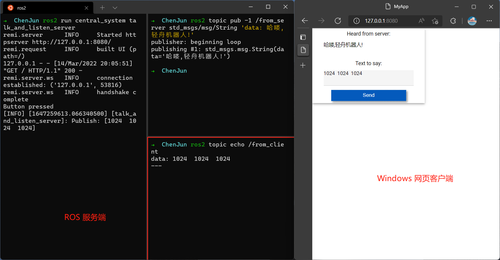

# 中央任务调度系统-通信开发

## Web 实现

[Source Code](central_system/talk_and_listen_server.py)

使用了 ROS2 的 Python 框架 [rclpy](https://github.com/ros2/rclpy) 及 一个轻量的 Python GUI 库 [remi](https://github.com/rawpython/remi)

> rclpy: ROS Client Library for the Python language.

> Remi is a GUI library for Python applications that gets rendered in web browsers. This allows you to access your interface locally and remotely.

### 主要思路

1. 使用 rclpy 创建一个节点用于和 ROS2 系统交互，负责订阅 ROS 的消息，以及将 web 页面的文本输入以 `std_msgs/msg/String` 的消息类型发布出去

2. 使用 remi 创建一个网页端的 GUI，使得任何装有浏览器的设备都可与之交互。这个 GUI 界面主要包含了一个 label 用于显示 server 端的发布的数据，一个文本输入框用于输入向 server 发布的数据，一个按钮用于触发发布事件。

### 实现效果图



### 使用 Docker 部署

构建镜像
```SHELL
# 在 Dockerfile 路径下
docker build -t central_system .
```

启动容器
```SHELL
docker run -it --rm --name cs -p 8080:8080 central_system
```

打开浏览器，输入 `localhost:8080` 即可连接到服务端

通过服务端向网页客户端发送信息及接收网页端的消息
```SHELL
# 进入容器
docker exec -it cs bash
# 执行 ROS setup 脚本
source install/setup.bash
# 发布消息
ros2 topic pub -1 /from_server std_msgs/msg/String 'data: 哈喽,轻舟机器人!'
# 接收消息
ros2 topic echo /from_client
```
